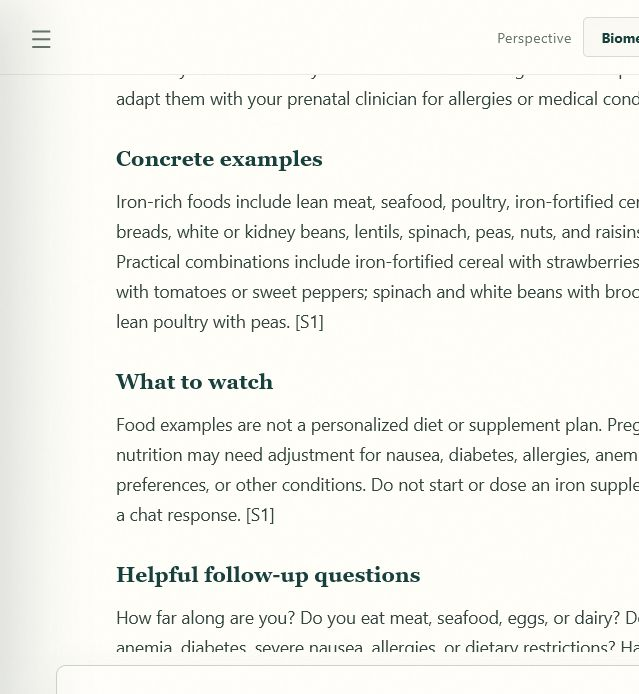
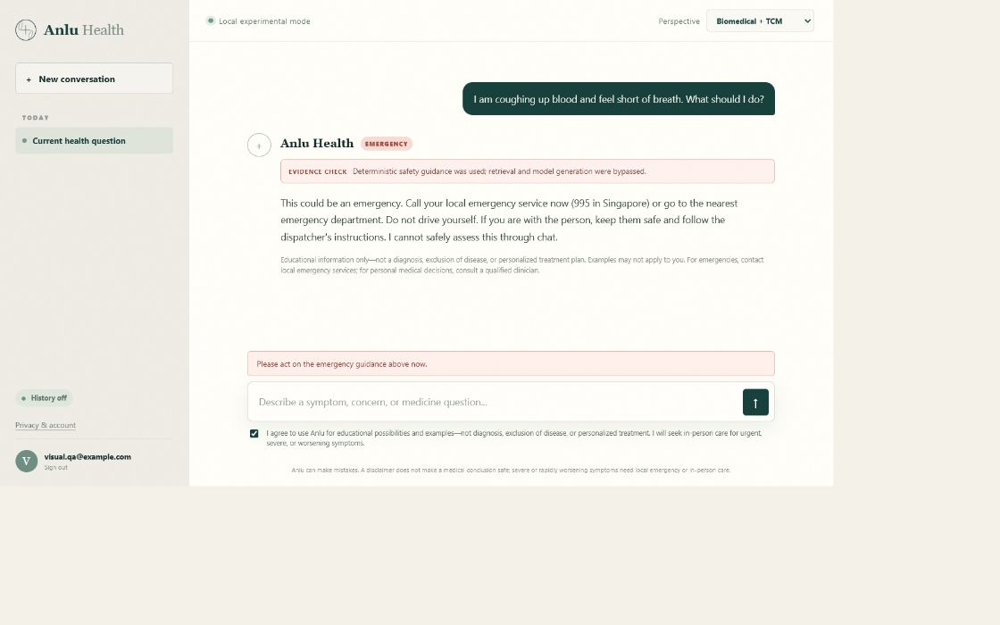

# Anlu Health

Anlu Health is a safety-first, evidence-grounded health information assistant. It combines
deterministic emergency triage, hybrid retrieval from approved sources, citation-constrained
generation, privacy-aware authentication, and an offline evaluation gate. It supports biomedical
and traditional Chinese medicine questions while clearly separating traditional frameworks from
clinical evidence.

> **Scope:** education and care navigation only. It does not diagnose, prescribe, interpret images,
> or replace a licensed clinician. Any public launch needs clinical, legal, privacy, security, and
> accessibility review for the intended country and population.

## See it in action

These screenshots were captured from the running localhost application in its clearly disclosed
deterministic demo mode. They demonstrate the working chat UI, consent control, approved-source
retrieval, inline citations, and emergency model bypass. They are not evidence of clinical efficacy
and do not imply that the private V32 GPU endpoint is currently available.

### Detailed, source-grounded nutrition example

The complete exchange shows the user's question, specific iron-rich foods, practical food
combinations, safety boundaries, follow-up questions, and the reviewed FDA source used in the answer.



### Deterministic emergency escalation

The complete exchange shows how high-risk wording bypasses retrieval and model generation. The
application immediately displays the configured local emergency number and tells the user not to
rely on chat.



| Capability | Repository evidence |
| --- | --- |
| Detailed grounded answers | Concrete food, symptom-pattern, and follow-up examples are constrained to retrieved source excerpts. |
| Emergency safety | Deterministic safety checks can bypass both RAG and model inference. |
| Retrieval | Hybrid keyword/vector ranking, approval, freshness, evidence tiers, and citation validation; the localhost vector provider is currently a deterministic feature hash rather than a neural embedding model. |
| V32 release candidate | 30/30 held-out cases and 30/30 turn-boundary checks passed; see [`model_registry/runs/medgemma_kaggle_v32_launch.json`](model_registry/runs/medgemma_kaggle_v32_launch.json). |
| Current release posture | Private localhost evaluation only. Clinical, privacy/security, and retrieval-safety reviews remain required before promotion. |

## What is included

- FastAPI website with email/password authentication, revocable opaque sessions, CSRF protection,
  security headers, rate limiting, account deletion, and health/metrics endpoints.
- Medical safety layer that bypasses the model for emergencies and escalates concerning lump
  descriptions before retrieval or generation.
- PostgreSQL knowledge store with pgvector HNSW semantic search, indexed full-text keyword search,
  hybrid rank fusion, source approval, evidence tiers, expiry dates, and citation validation.
- A model-provider interface for a separately hosted open-weight model. V32 is a private LoRA
  release candidate over `google/medgemma-1.5-4b-it`; it passed the automated held-out and
  turn-boundary gates but is limited to private localhost validation pending human approvals.
- Render Blueprint and Docker deployment; no model weights or large datasets are stored locally.
- Colab QLoRA notebooks, a pinned open-dataset preparation pipeline, DVC stages, dataset/model cards,
  golden safety cases, CI, and scheduled evaluation workflows.

## Run locally on Windows

### 1. One-time setup

Open PowerShell and run these commands in order:

```powershell
git clone https://github.com/LawWeiTin/anlu-health.git
Set-Location anlu-health
Copy-Item .env.example .env
py -3.12 -m venv .venv
.\.venv\Scripts\Activate.ps1
python -m pip install --upgrade pip
python -m pip install -r requirements-dev.txt
```

If PowerShell blocks virtual-environment activation, run this once in that terminal and activate
again:

```powershell
Set-ExecutionPolicy -Scope Process -ExecutionPolicy Bypass
.\.venv\Scripts\Activate.ps1
```

### 2. Start the app

From the repository directory:

```powershell
.\.venv\Scripts\Activate.ps1
python -m alembic upgrade head
python scripts/ingest.py data/seed_knowledge.jsonl
python -m uvicorn app.main:app --host 127.0.0.1 --port 8000 --reload
```

Keep that terminal open. The final command runs the web server; press `Ctrl+C` there to stop it.

### 3. Open it in your browser

In a second PowerShell window:

```powershell
Start-Process "http://127.0.0.1:8000"
```

You can also enter [http://127.0.0.1:8000](http://127.0.0.1:8000) manually.

The default `.env.example` starts the explicit localhost demo with deterministic mock inference and
embeddings, allowing the UI, authentication, retrieval, citations, and safety paths to run without
downloading model weights. Mock mode is rejected when `APP_ENV=production`.

If an existing `.env` points to a hosted model and you want a one-session local demo without editing
that file, set these variables before the `uvicorn` command:

```powershell
$env:MODEL_PROVIDER = "mock"
$env:MODEL_API_URL = ""
$env:MODEL_API_TOKEN = ""
$env:EMBEDDING_PROVIDER = "mock"
```

### Docker/PostgreSQL alternative

```powershell
docker compose up --build
docker compose exec app python scripts/ingest.py data/seed_knowledge.jsonl
```

Then open [http://127.0.0.1:8000](http://127.0.0.1:8000). Use `docker compose down` to stop the
stack.

## Production inference

Host the tuned model separately on a private GPU service using vLLM/TGI or a managed open-model
endpoint. Configure its OpenAI-compatible chat URL and a separately approved 384-dimensional
embedding provider using `.env.example`. A chat endpoint is not automatically an embedding
endpoint; after changing the embedding provider, rebuild the approved-source index with
`scripts/ingest.py`.

User questions and retrieved context are transmitted to that configured inference provider. Review
and document its current data-retention, processing-location, and privacy terms before opening the
service to real health information.
Render hosts the stateless web service and pgvector database; it does not download the 4B model.

Before enabling real users:

1. Review [docs/SAFETY.md](docs/SAFETY.md) and complete its clinical release checklist.
2. Populate the RAG index only from the approved [data/source_registry.yaml](data/source_registry.yaml).
3. Run `python scripts/evaluate.py --strict` and `python scripts/evaluate_rag.py --strict`, and
   require all release gates to pass.
4. Have qualified Western and Chinese medicine clinicians review a representative, multilingual
   evaluation set. Benchmark scores are not a substitute for this review.
5. Complete the privacy, regulatory, threat-model, and incident-response work for your jurisdiction.

## Deployment on Render

1. Push this repository to GitHub and create a Render Blueprint from `render.yaml`.
2. Enter a fine-grained Hugging Face inference-only token for `HF_TOKEN` when Render prompts. Do not
   grant repository write access to this token.
3. The Blueprint migration and ingestion pre-deploy command initializes the approved seed corpus.
4. Confirm `/health/ready`, then keep auto-deploy gated on passing GitHub checks.

## Google Drive artifact storage

The Colab notebook mounts Drive and writes large checkpoints only beneath
`MyDrive/Anlu Health/Model Adapters`. Datasets, evaluation reports, and release artifacts have their
own sibling folders. The workflow is additive: it creates timestamped run directories and does not
delete, replace, or reorganize existing Drive content.
The bounded open-data pilot is `training/medgemma_open_data_pilot_colab.ipynb`; it prepares MedQuAD
and the non-test portion of PubMedQA remotely, records attribution and checksums, and never promotes
its adapter automatically.

Render PostgreSQL supports pgvector. Use paid plans with backups and high availability appropriate
to your risk assessment; the sample plans are starter defaults, not a clinical availability claim.

## Repository map

See [docs/ARCHITECTURE.md](docs/ARCHITECTURE.md), [docs/DEPLOYMENT.md](docs/DEPLOYMENT.md),
[docs/MLOPS.md](docs/MLOPS.md), and [docs/DATA_GOVERNANCE.md](docs/DATA_GOVERNANCE.md).

## Security

The repository runs Ruff, Bandit, pytest, CodeQL, dependency audits, deterministic medical-safety
evaluation, hybrid-RAG evaluation, and `scripts/check_public_release.py`. The public-release gate
rejects tracked provider tokens, private keys, credential-bearing URLs, private service locations,
personal cloud identifiers, and tracked `.env` files. Keep real credentials only in the secret
manager for the deployment platform; `.env.example` contains names and blank placeholders only.

See [SECURITY.md](SECURITY.md) for responsible disclosure. Do not include real health information,
access tokens, endpoint credentials, or exploit details in a public issue.
