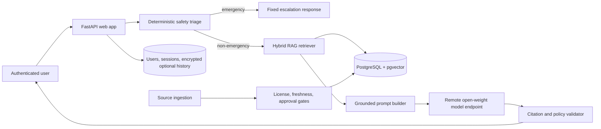

# Architecture

Anlu Health deliberately separates the safety-critical path from probabilistic model output.

## Runtime boundaries

- **Web service:** FastAPI serves the static UI and JSON API. It holds no model weights.
- **Data plane:** Render PostgreSQL stores accounts, revocable sessions, source metadata, chunks, and
  pgvector embeddings. Unapproved or stale sources are excluded at query time.
- **Inference plane:** an OpenAI-compatible endpoint hosts the tuned open-weight model. This can be
  vLLM/TGI on a GPU provider or a managed endpoint. It is independently scalable and replaceable.
- **Safety plane:** local, deterministic rules identify high-recall emergency and lump red flags before
  model inference. The model cannot downgrade this urgency.
- **MLOps plane:** DVC describes reproducible preparation/evaluation stages; Colab performs QLoRA;
  MLflow is optional for experiment tracking; GitHub Actions gates commits and scheduled evaluations.

## Request flow

1. Opaque session and CSRF tokens are validated; rate limits are applied.
2. The message is safety-classified without sending it to an external service.
3. Emergency messages receive a fixed, localized escalation response and bypass the model.
4. Other messages are embedded and searched against approved, current source chunks.
5. The prompt includes retrieved text, source IDs, evidence tiers, and the non-downgradable urgency.
6. The remote model drafts a cautious educational response.
7. Unknown citations are removed, evidence limitations are surfaced, and the answer plus source cards
   are returned. Logs contain only request metadata and a short one-way message fingerprint.

## Scaling

- Add Render Key Value and set `REDIS_URL` for distributed rate limiting across multiple web replicas.
- Use a pgvector HNSW index and connection pooling for larger corpora.
- Scale the GPU endpoint independently from the web tier.
- Run ingestion as a controlled job, never inside web requests.
- Put source documents and evaluation artifacts in versioned object storage; keep only manifests and
  checksums in Git.

## Intentional non-features

- No image-based lump diagnosis. Consumer photos are not a safe substitute for examination.
- No medication or herbal prescribing/dosing.
- No direct electronic health record integration.
- No default chat retention.
- No autonomous model or dataset promotion.
