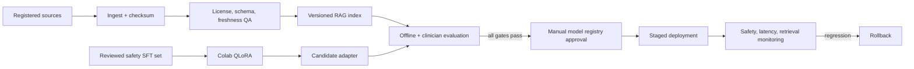

# MLOps workflow

## Reproducibility

- `dvc.yaml` records preparation and offline evaluation stages.
- `params.yaml` defines release thresholds.
- `training/medgemma_kaggle_qlora.py` trains in a private Kaggle GPU runtime; no weights are
  downloaded locally.
- `training/open_datasets.yaml` pins every public dataset revision and license. The Colab preparation
  step keeps PubMedQA's official test IDs out of training, filters MedQuAD to lower-risk educational
  targets, records attribution, and prevents condition-level train/validation leakage.
- Colab writes checkpoints to a new timestamped directory beneath
  `MyDrive/Anlu Health/Model Adapters`; evaluation outputs use the matching timestamp beneath
  `Evaluation Reports`. Existing Drive content is never deleted or replaced by the notebook.
- `model_registry/production.yaml` pins the base model, adapter, prompt, embedding model, source
  manifest, and evaluation report. Replace placeholders only after validation.
- MLflow logging is optional and should point to an access-controlled tracking server.
- The hosted Qwen baseline and an eventual reviewed MedGemma adapter are separate registry entries;
  promoting a candidate never silently changes the deployed endpoint.
- The remote release suite uses the production-aligned assistant policy, hidden prompts that are
  leakage-checked against training, negation-aware claim checks, category-specific length limits,
  clean-termination checks, and rejection of leaked prompt/meta text. A candidate must pass every
  case and must not regress against its own pre-training baseline.

## Promotion policy

Candidates never self-promote. A release requires finite training and validation losses, complete
adapter checksums, a perfect critical-behavior suite, no baseline regression, and documented
sign-off from a
medical reviewer, TCM reviewer when applicable, privacy/security owners, and the product owner.
Canary traffic should contain synthetic probes only until the intended-use review is complete.

## Monitoring without collecting health text

Track latency, status codes, safety-route counts, retrieval hit rate, evidence-tier distribution,
unknown-citation removals, abstention rate, and user-reported harmful-answer counts. Do not export raw
queries or responses to telemetry. Drift review uses opt-in, de-identified, separately governed data
or synthetic probes.

## Rollback

Keep the previous model endpoint and registry manifest available. Roll back on emergency-recall
regression, citation failure, unexpected refusal/overconfidence, source corruption, latency SLO
breach, or a security/privacy incident. Disable generation entirely if retrieval or model integrity
cannot be established.
